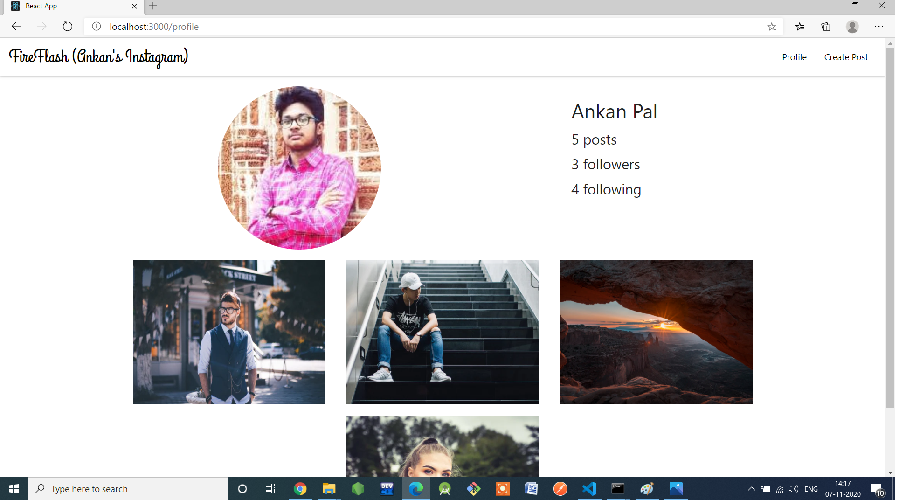
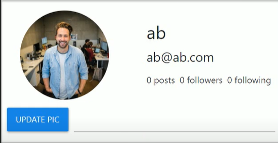
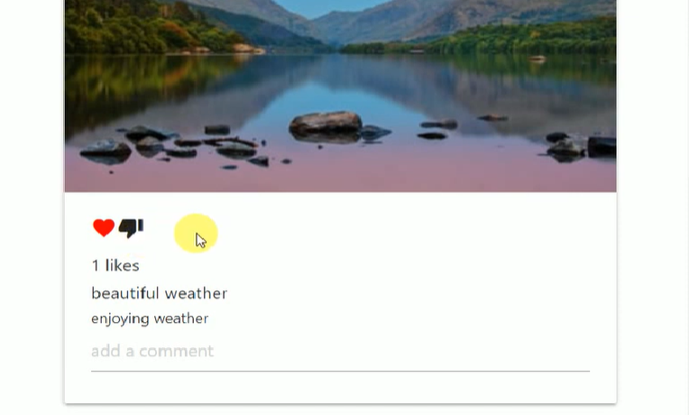

# FireFlash (Ankan's Instagram) 
### ⭐ ✅ MERN STACK(Mongodb,Express,React,Nodejs)

 It is a real time social media web application made by me(Ankan Pal) named <b>"FireFlash"</b>  which consists of all major functions of Instagram including signup,signin, create post,delete post, follow and unfollow users,make comments and many more.You can refer to the code.It is a MERN stack project comprising Reactjs, MongoDB,Expressjs and Nodejs.I have used postman to check the API calls.You can check the images folder to view my application.This is a REACT Application Built Cloning All the basic functionalities that the Social media platform Instagram Provides ✨

<b>⭐I have added detailed explanation of the entire codebase in the form of comments so that anyone familiar with MERN stack can understand.</b>

# Features :
Sneaky features of FireFlash ✅ :

⭐ Create Your Profile ⭐ Login & SignUp using Jwt Authentication ⭐ Upload And Edit Your Display Profile ⭐ Create a new Post to be featured on the Wall ⭐ Like Others Post ⭐ Comment on Others Post ⭐ Real-time display of Followers and Followings ⭐ Follow and Unfollow Other Users ⭐ Delete Your Post

# Tech Stack Involved :
❓ Database : MongoDB

❓ Frontend : ReactJs , Materialize-Css , Html and CSS

❓ Server -side : NodeJs , ExpressJs

❓ Authentication : Token Based Authentication

❓ Email verification : Email regex

❓ HTTP requests and API verification : Postman

❓ Sending signup mail : Nodemailer

❓ Hashing Password : bcrypt.js

❓ Deployment : Heroku

 

# Overview of all functionalities in the steps of completion of the social media web application 
## ⭐ Original (Previous) Version :
## 1.Signup (for new users)

## 2.Invalid email check during signup(Using email Regex).We get to see a Red Toast message!!!

## 3. Saved successfully display on signup success and redirect to signin page and details get saved in my mongoDB account with hashed password. We get to see a Green Toast Message!!!

## 4.Signin and successful signup before loading home screen

## 5.Home screen 

## 6.Profile of signed in user

## 7. Create post

## 8. Post details saved in my mongoDB

  
  
## 9. Post image also gets saved in my cloudinary

  
  
 ## 10.Update profile picture of signed in user
 
 
  
  
  
  
## 11. Like and unlike post (If liked then unlike button appears and vice-versa) 
  
  
  
  
  
  
  
  
  
  
  ## 12. Follow and unfollow any user(If followed then infollow button appears and vice versa)
  
   
  
  
   
  
  
  
  ## 13.Add comments to posts
  
  
   
  
  
  
 ## 14. Using postman to verify the post requests 
 
 
 
 
 
 
 
 
 
 
 ## 15. Using postman to verify the get requests 
 
 
 
 
 
 
 
 
  
